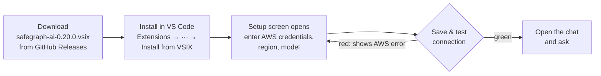
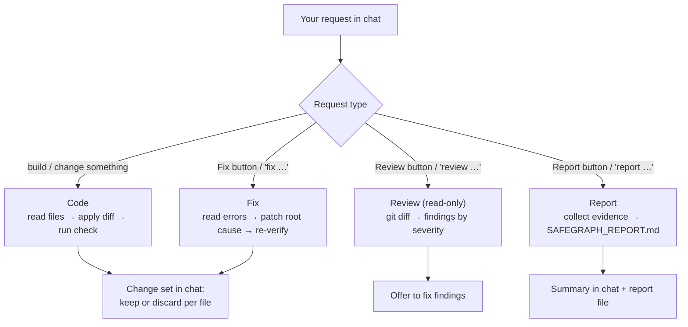
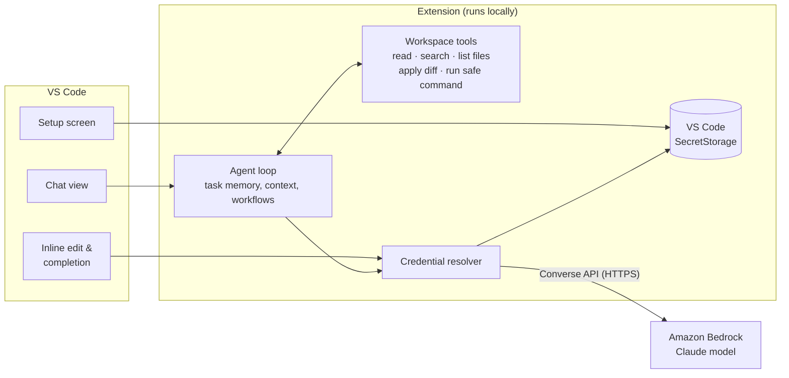
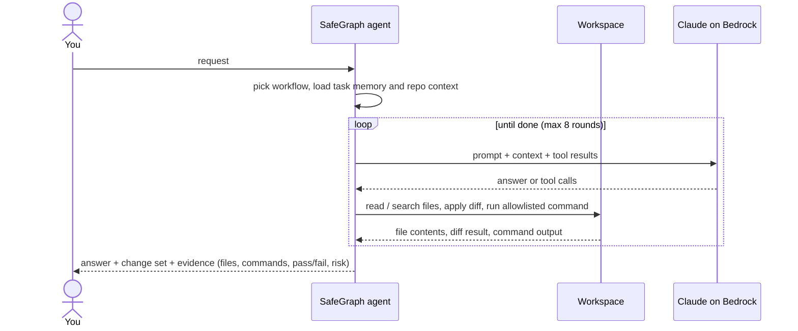
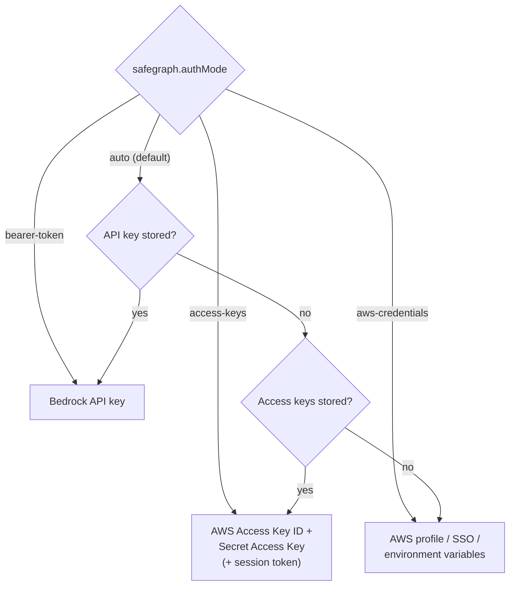
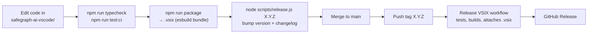

# SafeGraph AI

**A VS Code coding agent powered by Claude on Amazon Bedrock.** Ask it to write code, fix bugs, review changes or write a project report — it reads your repository, applies real diffs, runs safe checks and tells you what changed.

Current extension version: `0.20.0` · Default model: **Claude Haiku 4.5** on Amazon Bedrock

---

## Quick Start



1. Download `safegraph-ai-0.20.0.vsix` from [Releases](https://github.com/HTL2910/AWS-AI-chatbot/releases).
2. Install it from the Extensions view (`···` → **Install from VSIX...**) or:

   ```bash
   code --install-extension safegraph-ai-0.20.0.vsix --force
   ```

3. The **Safegraph AI Setup** screen opens on first run (or run `Safegraph AI: Setup`). Enter credentials, keep the pre-filled region/model or change them, click **Save & test connection**.
4. Click the Safegraph AI icon in the Activity Bar and start asking.

Check the installed version with `code --list-extensions --show-versions | grep safegraph` → `safegraph.safegraph-ai@0.20.0`.

---

## What You Can Ask



| Mode | Example | Edits files? |
|---|---|---|
| **Code** | "Add a /health endpoint that returns the build version" | Yes, as reviewable diffs |
| **Fix** | "Fix the failing tests" | Yes, then re-runs verification |
| **Review** | "Review my current changes" | No |
| **Report** | "Write a project report" | Only `SAFEGRAPH_REPORT.md` |

Also available: **inline edit** (select code, `Ctrl/Cmd+K`), **ghost-text completion** while typing, and follow-ups like "continue" that stay on the same task.

---

## How It Works



There is no SafeGraph server: the extension calls Amazon Bedrock Runtime directly with your credentials, and every request is billed to your AWS account.

One task runs as a loop until the model has enough evidence to finish:



---

## Authentication

Pick one method in the Setup screen. Secrets are stored in VS Code SecretStorage on your machine, never in settings files.



| Method | Where to get it | Best for |
|---|---|---|
| Bedrock API key | Bedrock console → **API keys** | Quick personal setup |
| AWS access key | IAM user → **Security credentials** | Teams without SSO |
| Profile / SSO | `aws configure sso` then `aws sso login --profile <name>` | Enterprise accounts |

The IAM principal needs `bedrock:InvokeModel` and `bedrock:InvokeModelWithResponseStream`, and access to the model must be enabled in the Bedrock console for your region. AWS docs: [model access](https://docs.aws.amazon.com/bedrock/latest/userguide/model-access.html), [API keys](https://docs.aws.amazon.com/bedrock/latest/userguide/api-keys-generate.html), [CLI SSO](https://docs.aws.amazon.com/cli/latest/userguide/cli-configure-sso.html).

---

## Troubleshooting

| Message | Fix |
|---|---|
| AWS credentials are not configured | Run `Safegraph AI: Setup` |
| `The security token included in the request is invalid` | Wrong access key/secret, or temporary keys missing the session token |
| `AccessDeniedException` | Grant the Bedrock permissions above and enable model access |
| Model not available in region | Change region, or use an inference profile ID (`global.`, `us.`, `apac.`) |
| Expired SSO session | `aws sso login --profile <name>` |
| Anything else | `Safegraph AI: Open Log` |

---

## Settings

| Setting | Default | Purpose |
|---|---|---|
| `safegraph.authMode` | `auto` | `auto`, `bearer-token`, `access-keys`, `aws-credentials` |
| `safegraph.region` | `ap-southeast-1` | Bedrock region |
| `safegraph.modelId` | Claude Haiku 4.5 (global) | Model ID or inference profile ARN |
| `safegraph.awsProfile` | empty | Profile for `aws-credentials` |
| `safegraph.autoRun` | `safe` | Agent mode: `safe` runs allowlisted build/test commands, `ask` asks every time, `off` never runs |
| `safegraph.completion.*` | | Ghost-text completion on/off, trigger, model |
| `safegraph.repositoryRag.*` | | Size limits for repository context |

---

## Cost, Security, Limits

- Bedrock usage costs money on your AWS account — set up billing alerts.
- Commands the agent proposes run only if allowlisted or approved; review change sets before keeping them.
- Model quality depends on the Bedrock model you pick.
- Not included yet: browser automation, semantic vector search, separate multi-agent workers.

---

## Develop &amp; Release



```bash
cd safegraph-ai-vscode
npm ci
npm run typecheck
npm run test:ci
npm run package        # writes safegraph-ai-<version>.vsix
```

Press `F5` with `safegraph-ai-vscode/` open in VS Code to start an Extension Development Host.

### Repository layout

```text
.
├── safegraph-ai-vscode/   # The VS Code extension (maintained product)
│   ├── src/               # Extension source: chat, setup, bedrock, tools
│   └── media/             # Chat UI script and styles
├── scripts/release.js     # Version bump / consistency check
├── .github/workflows/     # CI, lint, Release VSIX
├── docs/                  # Credential and usage notes
├── examples/              # Python Bedrock examples
└── legacy/                # Old Flask/Streamlit prototypes (unsupported)
```

More: [extension README](safegraph-ai-vscode/README.md) · [CHANGELOG](CHANGELOG.md) · [credential guide](docs/CREDENTIALS_GUIDE.md) · [renew API key](docs/RENEW_API_KEY.md)

## License

See [LICENSE](LICENSE).
